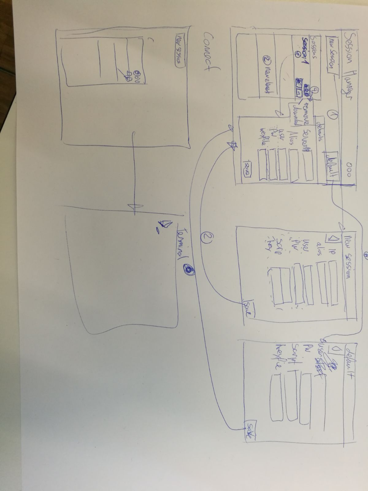

# Projektbeschreib

Eine Web Standalone Applikation (basierend auf Electron) welche es ermöglicht SSH verbindungen zu managen.
Aus der Applikation soll direkt der gnome-terminal gestartet werden.

# Papierprototype

# Research / Know-How

## Open gnome-terminal

~~~bash
gnome-terminal -- ssh username@host
~~~
