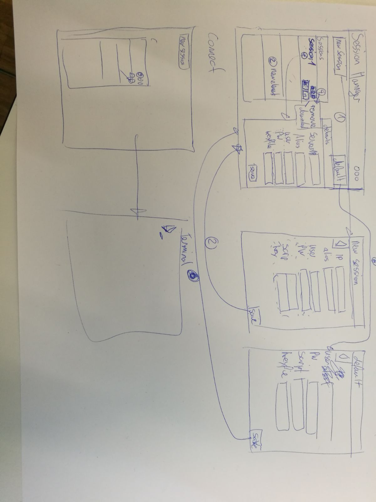

# Projektbeschreib

Eine Web Standalone Applikation (basierend auf Electron) welche es ermöglicht SSH verbindungen zu managen.
Aus der Applikation soll direkt der gnome-terminal gestartet werden welche eine SSH Verbindung zum ausgewählten Host aufbaut.

# Papierprototype

# Research / Know-How

## Open gnome-terminal

~~~bash
gnome-terminal -- ssh username@host
~~~

## ssh execute command

~~~bash
ssh -t 'command; bash -l'
~~~

## Setup
`npm install -g vue-cli`
